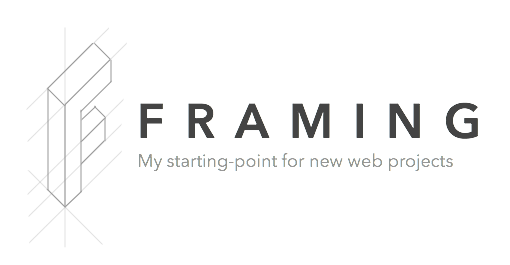

# WORK IN PROGRESS

Before you go any further, let me just say, DO NOT USE THIS PROJECT!

“But…” you say, “you put it on GitHub and gave it a fancy logo.”

Yes, I did. But that’s only because I like fancy logos and I like GitHub. Get off my back.

There are *literally* tens of millions of UI Toolkits and Frameworks out there, all mis-named as one or the other. You should use one of them – despite the fact that few of them will fit your exact needs, and most are rarely updated, you’re still better off using them instead of mine. You could also build your own (or even fork this one) and give it a fancy logo. It’s your life.

To ensure I’ve made my self clear, I’ll say this again: do not use this project. I have no intention of treating this as a project built for anyone other than myself.